Databases and SQL for Data Science
===================================

by IBM

# Module 1

#
## Title: Introduction to Databases and Basic SQL

## Introduction to Databases

### Welcome to SQL for Data Science

* The demand for data scientists is high, boasting a median base salary of $110,000 and job satisfaction score of 4.4 out of five
	* It's no wonder that it's the top spot on Glassdoor's best jobs in America
* Glassdoor analyzed data from data scientist job postings on Glassdoor and found that SQL is listed as one of the top three skills for a data scientist
* One of the foundational skills that you will require is SQL
* SQL is a powerful language that's used for communicating with databases
* Every application that manipulates any kind of data needs to store that data somewhere; whether it's __big data__, or just a __table__ with a few simple rows for government, or a small startup, or a __big database__ that spans over multiple servers or a __mobile phone__ that runs its own __small database__
* __Advantages__ of SQL
	* SQL will boost your professional profile as a data scientist, as it is one of the most sought after skills by hiring employers
	* Learning SQL will give you a good understanding of relational databases
	* Tapping into all this information requires being able to communicate with the databases that store the data
	* Even if you work with reporting tools that generate SQL queries for you, it may be useful to write your own SQL statements so that you need not wait for other team members to create SQL statements for you

### Introduction to Databases

* Course Overview
			<p align="center">
			  <a href="javascript:void(0)" rel="noopener">
				 </a>
			</p>
* What is SQL?
	* **SQL** is a language used for relational databases to query or get data out of a database
	* **SQL** is also referred to as __SEQUEL__ and is short for its original name **S**tructured **E**nglish **QUE**ry **L**anguage
	* So SQL is a language used for a database to query data
* Data
	* Data is a collection of facts in the form of words, numbers, or even pictures
	* Data is one of the most critical assets of any business
		* It is used and collected practically everywhere
	* Example
		1. Your bank stores data about you, your name, address, phone number, account number etc
		1. Your credit card company and your paypal accounts also store data about you
* Database
	* Databases are everywhere and used every day, but they are largely taken for granted
	* A database is a repository of data. It is a program that stores data
	* A database also provides the functionality for adding, modifying, and querying that data
	* There are different kinds of databases of different requirements
	* The data can be stored in various forms
		1. __Relational Database__ - When data is stored in tabular form, the data is organized in tables like in a spreadsheet, which is columns and rows
			* A relational database stores data in a tabular format - i.e. in rows and columns. *But not all types of databases use the tabular format*
			* The columns contain properties about the item such as last name, first name, email address, city
			* A table is a collection of related things like a list of employees or a list of book authors
			* In a relational database, you can form relationships between tables
				<p align="center">
				  <a href="javascript:void(0)" rel="noopener">
					 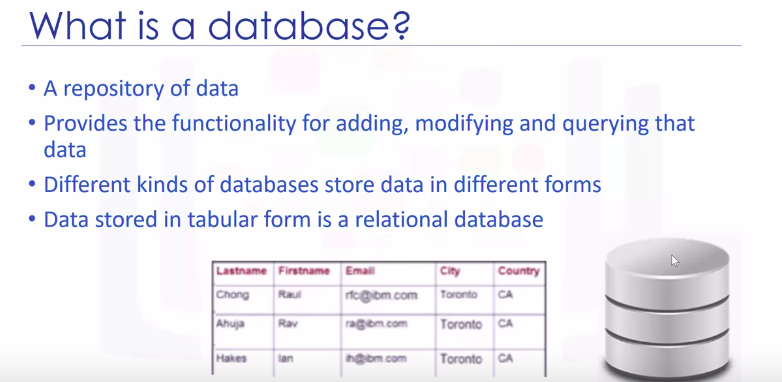</a>
				</p>
	* A set of software tools for the data in the database is called a **D**ata**B**ase **M**anagement **S**ystem or __DBMS__ for short
	* The terms database, database server, database system, data server, and database management systems are often used interchangeably
* __RDBMS__ or **D**ata**B**ase **M**anagement **S**ystem
	* RDBMS is a set of software tools that controls the data such as access, organization, and storage
	* RDBMS serves as the backbone of applications in many industries including banking, transportation, health, and so on
	* Examples of relational database management systems are
		1. MySQL
		1. Oracle Database
		1. DB2 Warehouse on Cloud
		1. DB2 Express-C
				<p align="center">
				  <a href="javascript:void(0)" rel="noopener">
					 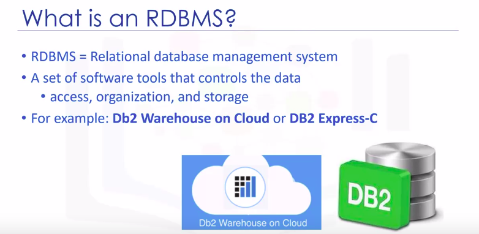</a>
				</p>
* __Basic SQL Commands__
	* There are five simple commands to
		1. Create a table
		1. Insert data to populate the table
		1. Select data from the table
		1. Update data in the table
		1. Delete data from the table

> A __database__ is __repository__ of data. You can add, modify, and query data in a database. And when it comes to relational databases, SQL is the language commonly used for querying data

#### Summary

* Summary of Lesson
				<p align="center">
				  <a href="javascript:void(0)" rel="noopener">
					 </a>
				</p>

### How to create a Database instance on Cloud

* __Cloud Databases__
	* A __cloud database__ is a database service built and accessed through a cloud platform
	* It serves many of the same functions as traditional databases with the added flexibility of cloud computing
	* Users install software on a cloud infrastructure to implement the database
	* __Advantages__
		1. __Ease of Use__
			* Users can access cloud databases from virtually anywhere using a vendors API or web interface
		1. __Scalability__
			* Cloud databases can expand their storage capacities during runtime to accommodate changing needs, organizations only pay for what they use
		1. __Disaster Recovery__
			* In the event of a natural disaster equipment failure or power outage data is kept secure through backups on remote servers
	* Few Examples of cloud SQL databases are
		1. IBM Db2 on Cloud
		1. Compose for PostgreSQL
		1. Oracle Database Cloud
		1. Microsoft Azure Cloud - SQL Database
		1. Amazon Relational Database Services, which can run in the cloud, either in a virtual machine or as a service depending on the vendor
* __What is Database Service Instance?__
	* __Database services__ are __logical abstractions__ for managing __workloads__ in a database
	* Each service represents a workload with
		1. common attributes
		1. service level thresholds
		1. priorities
	* The grouping is based on attributes of work that might include
		1. the application function to be used
		1. the priority of execution for the application function
		1. the job class to be managed
		1. the data range used in the application function or job class
	* An instance of the cloud database operates as a service that handles all application requests to work with the data and any of the databases managed by that instance
	* The database service instance is the target of the connection request from applications
		* The application used will be Python
		* When a connection has been completed, your Python code sends SQL statements across the connection to the instance of the database
		* The database instance then resolves the SQL statements into operations against the data and objects in the database
		* Any data retrieved is returned to the application	
				<p align="center">
				  <a href="javascript:void(0)" rel="noopener">
					 </a>
				</p>
	* After creating a DB service on IBM cloud, you will get connection details
		* The connection details include the following
			1. A __host name__, which is a unique name or label assigned to any device that is connected to a specific computer network
			1. A __port number__, which is the database port
			1. The __database__ name, which is the database name
			1. A __user ID__, which is the username you'll use to connect
			1. __Password__, is the password you'll use to connect
				<p align="center">
				  <a href="javascript:void(0)" rel="noopener">
					 </a>
				</p>


## Basic SQL

### CREATE Table Statement

* Lecture course_overview
				<p align="center">
				  <a href="javascript:void(0)" rel="noopener">
					 </a>
				</p>
* There are five simple statements to
	1. create the table
	1. insert data into the table
	1. select data from the table
	1. update data in the table
	1. delete data from the table
* These statements (statements mentioned above) fall into two different categories
	1. Data Definition Language Statements (DDL)
		* Data definition language or DDL statements are used to define, change, or drop data
	1. Data Manipulation Language Statements (DML)
		* Data manipulation language or DML statements are used to read and modify data
* In a relational database, the data is organized in tables, like in a spreadsheet, which is columns and rows
* For Example
	* Based on the book entity an author entity examples, we create the tables using the entity name
				<p align="center">
				  <a href="javascript:void(0)" rel="noopener">
					 </a>
				</p>
		* The entity attributes will be the columns of the table
		* Using the author entity as the example, assign data types to the attributes of the table
		* In this example, the following data types are used
			1. Char is a character string of a fixed length
			1. Varchar is a character string of a variable length
		* In addition, the author_id attribute is assigned as the primary key, so that no duplicate values can exist
		* The author table is created using the CREATE TABLE statement
		* __Note__ that the author_id is the primary key
			* This constraint prevents duplicate values in the table
		* __Note__ that last name and first name have the constraint not null
			* This ensures these fields cannot contain a null value
			* Therefore, author must have a name
* The __primary key__ of a relational table uniquely identifies each tuple or row in a table
* The __CREATE TABLE__ statement is one of the data definition language statements
	* __Data Definition Language__ statements or __DDL__ statements are used to create database objects
* __Data Definition Language Statements__, which are used to define, change, or drop data
* __Data Manipulation Language Statements__, which are used to read and modify data

> __DDL__ stands for **D**ata **D**efinition **L**anguage. A create table statement is an example of DDL because it is used for defining structure of the database objects.


### SELECT Statement

* Lecture course_overview
				<p align="center">
				  <a href="javascript:void(0)" rel="noopener">
					 </a>
				</p>
* Retrieving Rows from a Table
	* The main purpose of a database management system, is not just to store the data but also facilitate retrieval of the data
	* The SELECT statement is a data manipulation language statement
	* __Data Manipulation Language__ statements or DML statements are used to read and modify data
	* The __SELECT__ statement is called a __query__, and the output we get from executing this query is called __a result set__ or __a result table__
				<p align="center">
				  <a href="javascript:void(0)" rel="noopener">
					 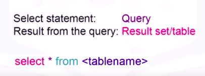</a>
				</p>
	* Example
		* Based on the book entity example, we would create the table using the entity name book and the entity attributes as the columns of the table
		* The data would be added to the book table by adding rows to the table using the insert statement
		* In the book entity example, select star from book gives the result set of four rows
				```SQL
				>>> select * from book;
				```
				<p align="center">
				  <a href="javascript:void(0)" rel="noopener">
					 </a>
				</p>
		* All the data rows for all columns in the table book are displayed
		* In addition, you can also retrieve all the rows for all columns by specifying the column names individually in the SELECT statement
		* You can retrieve just a subset of columns. If you want, you can retrieve just two columns from the table book
				```SQL
				>>> select <col_1>, <col_2> from book;
				```
				<p align="center">
				  <a href="javascript:void(0)" rel="noopener">
					 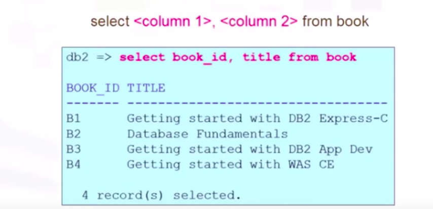</a>
				</p>
		* __NOTE__ that the order of the columns displayed always matches the order in the SELECT statement
* WHERE Clause
	* Relational operation helps us in restricting the result set by allowing us to use the clause __WHERE__
	* The WHERE clause always requires a predicate. A predicate is conditioned evaluates to true, false or unknown.
	* Predicates are used in the search condition of the WHERE clause
				<p align="center">
				  <a href="javascript:void(0)" rel="noopener">
					 </a>
				</p>
	* Example
		1. So, if we need to know the title of the book whose book_id is B1, we use the WHERE clause with the predicate book_id equals B1
				```SQL
				>>> select book_id, title from book where book_id = 'B1'
				```
			* Notice the result set is now restricted to just one row whose condition evaluates to true
	* There are other comparison operators supported by a Relational DataBase Management System
		1. equal to (=)
		1. greater than (>)
		1. less than (<)
		1. greater than or equal to (>=)
		1. less than or equal to (<=)
		1. and not equal to (<>)

#### Summary

* Summary of Lesson
				<p align="center">
				  <a href="javascript:void(0)" rel="noopener">
					 </a>
				</p>


### COUNT, DISTINCT, LIMIT

* __COUNT__
	* COUNT is a built-in database function that retrieves the number of rows that match the query criteria
	* Syntax, to get the total number of rows in a given table
		```SQL
		>>> select COUNT(*) from tablename
		```
	* Let's say you create a table called MEDALS which has a column called COUNTRY, and you want to retrieve the number of rows where the medal recipient is from Canada
		```SQL
		>>> Select COUNT(COUNTRY) from MEDALS where COUNTRY='CANADA'
		```
		<p align="center">
		  <a href="javascript:void(0)" rel="noopener">
			 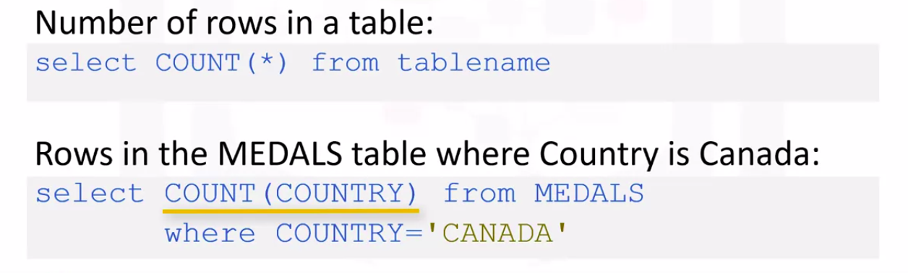</a>
		</p>
* __DISTINCT__
	* DISTINCT is used to remove duplicate values from a result set
	* Syntax, to retrieve unique values in a column
		```SQL
		>>> select DISTINCT columnname from tablename
		```
	* In the MEDALS table mentioned earlier, a country may have received a gold medal multiple times
		* Example, retrieve the list of unique countries that received gold medals. That is, removing all duplicate values of the same country
			```SQL
			>>> Select DISTINCT COUNTRY from MEDALS where MEDALTYPE = 'GOLD'
			```
			<p align="center">
			  <a href="javascript:void(0)" rel="noopener">
				 </a>
			</p>
* __LIMIT__
	* LIMIT is used for restricting the number of rows retrieved from the database
	* Syntax, to retrieve just the first 10 rows in a table
		```SQL
		>>> Select * from tablename LIMIT 10
		```
	* This can be very useful to examine the results set by looking at just a few rows instead of retrieving the entire result set which may be very large
	* Example, retrieve just a few rows in the MEDALS table for a particular year
		```SQL
		>>> select * from MEDALS where YEAR = 2018 LIMIT 5
		```
		<p align="center">
		  <a href="javascript:void(0)" rel="noopener">
			 </a>
		</p>

### INSERT Statement

* Lecture course_overview
				<p align="center">
				  <a href="javascript:void(0)" rel="noopener">
					 </a>
				</p>
* After table is created, the table needs to be populated with data
* To insert data into a table, we use the INSERT statement
	* The INSERT statement is used to add new rows to a table
* The INSERT statement is one of the data manipulation language statements
* __Data Manipulation Language__ statements or __DML__ statements are used to read and modify data
* Syntax, to insert data into table
	```SQL
	>>> insert into tablename <([ColumnName]. ...) VALUES ([Values], ...)
	```
	* In this statement
		1. table name identifies the table
		1. the column name list identifies each column in the table
		1. the values clause specifies the data values to be added to the columns in the table
	* __NOTE__
		* It is important that the number of values provided in the values clause is equal to the number of column names specified in the column name list
		* This ensures that each column has a value
* Based on the author entity example, we created the table using the entity name author, and the entity attributes as the columns of the table
	* Now we will add the data to the author table by adding rows to the table
	* To add the data to the author table, we use the INSERT statement
				<p align="center">
				  <a href="javascript:void(0)" rel="noopener">
					 </a>
				</p>
* Tables do not need to be populated one row at a time, multiple rows can be inserted by specifying each row in the values clause
	* In the values clause, each row is separated by a comma
	* Example
				<p align="center">
				  <a href="javascript:void(0)" rel="noopener">
					 </a>
				</p>

#### Summary

* Summary of Lesson
				<p align="center">
				  <a href="javascript:void(0)" rel="noopener">
					 </a>
				</p>


### UPDATE and DELETE Statements

* Lecture course_overview
				<p align="center">
				  <a href="javascript:void(0)" rel="noopener">
					 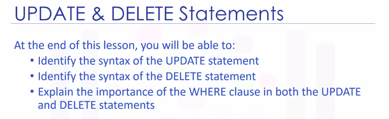</a>
				</p>
* __Update__
	* After a table is created and populated with data, the data in a table can be altered with the UPDATE statement
	* The __UPDATE__ statement is one of the __Data Manipulation Language__ or __DML__ statements
	* __DML__ statements are used to read and modify data
	* The syntax of the UPDATE statement 
		```SQL
		>>> UPDATE [TableName]
		>>>		SET [[ColumnName] = [Value], ...]
		>>> 		<WHERE [CONDITION]>
		```
		* In the statement,
			1. TableName identifies the table
			1. The ColumnName identifies the column value to be changed, as specified in the <WHERE [Condition]>
	* Based on the author entity example,
		* We created the table using the entity name Author and the entity attributes as the columns of the table
		* Rows were added to the Author table to populate the table
				<p align="center">
				  <a href="javascript:void(0)" rel="noopener">
					 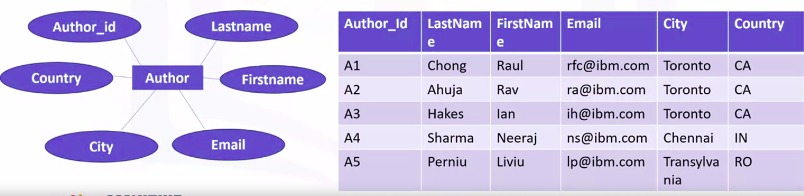</a>
				</p>
		* Sometime later, you want to alter the data in the table
		* To alter or modify the data in the Author table, we use the UPDATE statement
				<p align="center">
				  <a href="javascript:void(0)" rel="noopener">
					 </a>
				</p>
	* __Note__ that if you do not specify the WHERE clause, all the rows in the table will be updated
* __Delete__
	* There might be a need to remove one or more rows from a table
	* The rows are removed with the DELETE statement
	* The DELETE statement is one of the __Data Manipulation Language__ or __DML__ statements used to read and modify data
	* Syntax for DELETE statement
		```SQL
		>>> DELETE FROM [TABLE NAME]
		>>> 	<WHERE [CONDITION]>
		```
	* The rows to be removed are specified in the WHERE condition
	* Based on the author entity example,
		* We want to delete the rows for AUTHOR_ID A2 and A3
				<p align="center">
				  <a href="javascript:void(0)" rel="noopener">
					 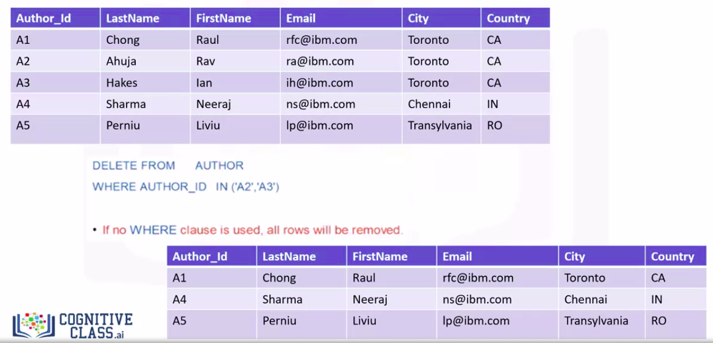</a>
				</p>
	* __Note__ that if you do not specify the WHERE clause, all the rows in the table will be removed

#### Summary

* Summary of Lesson
				<p align="center">
				  <a href="javascript:void(0)" rel="noopener">
					 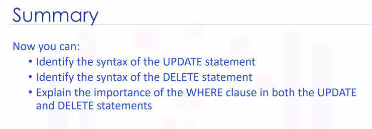</a>
				</p>


## OPTIONAL: Relational Database Concepts

### Information and Data Models

* Lecture course_overview
				<p align="center">
				  <a href="javascript:void(0)" rel="noopener">
					 </a>
				</p>
* __Information Model__ vs __Data Model__
	* This figure illustrates the relationship between an information model and a data model
				<p align="center">
				  <a href="javascript:void(0)" rel="noopener">
					 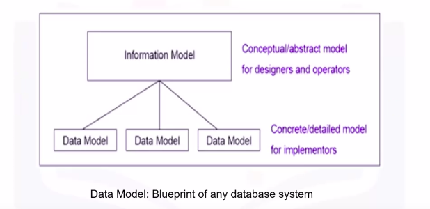</a>
				</p>
	* An __Information Model__ is an abstract formal representation of entities that includes their __properties__, __relationships__, and the __operations__ that can be performed on them
		* The entities being modeled can be from the real world, such as a library
	* Information models and data models are different and serve different purposes
		* An information model is at the conceptual level and defines relationships between objects
		* Data models are defined in a more concrete level, are specific, and include details
	* A __Data Model__ is the blueprint of any database system
	* There are several types of information models
		1. Hierarchical
				<p align="center">
				  <a href="javascript:void(0)" rel="noopener">
					 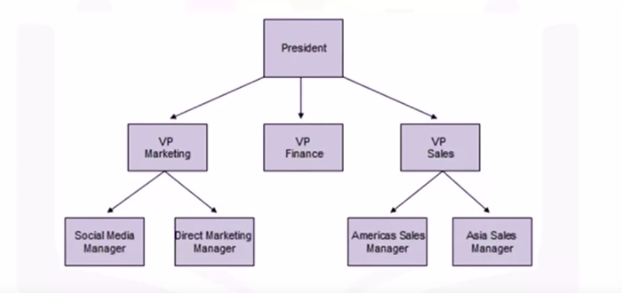</a>
				</p>
			* As shown in the figure above, the __hierarchical model__ organizes its data using a __tree structure__
			* The __root__ of the tree is the __parent node__ followed by __child nodes__
			* A __child node__ cannot have more than one parent
			* A __parent__ can have many child nodes
			* The first __Hierarchical Database Management System__ was the __Information Management System__ released by __IBM__ in __1968__, and was originally built as the data base for the __Apollo space program__
* __Relational Model__
	* The __Relational Model__ is the most used data model for databases, because this model allows for data independence
	* Data is stored in simple data structure tables
		* This provides __logical data independence__, __physical data independence__, and __physical storage independence__
	* An __Entity-Relationship Data Model__ or __ER Data Model__, is an alternative to a __Relational Data Model__
	* Using a simplified library database as an example, this figure below shows an **Entity-Relationship Diagram** or **ERD**, that represents entities called tables and their relationships
					<p align="center">
					  <a href="javascript:void(0)" rel="noopener">
						 </a>
					</p>
			* We have authors who write books, borrowers who take books out on loan, various copies of each book etc
			* This is the final ER diagram
* **Entity-Relationship Model** or **ER Model**
	* An entity-relationship model proposes thinking of a database as a collection of entities, rather than being used as a model on its own
	* The ER model is used as a tool to design relational databases
	* In the ER model,
		* __entities__ are __objects__ that exist independently of any other entities in the DataBase
	* It is simple to convert an ER diagram into a collection of tables
	* The __building blocks__ of an __ER__ diagram are
		1. __entities__
		1. __attributes__
	* __Entities__ have __attributes__, which are the data elements that characterize the __entity__
	* __Attributes__ tell us more about the entity
	* In an ER diagram
		1. an __entity__ is __drawn__ as a __rectangle__
		1. __attributes__ are __drawn__ as __ovals__
	* __Entities__ can be
		1. a noun
		1. person
		1. place
		1. thing
	* Example
		1. Using a simplified library as an example
			* a book is an example of an entity
			* Attributes are certain properties of characteristics of an entity and tell us more about the entity
			* The Entity book has attributes such as
				1. the book title
				1. the addition of the book
				1. the year the book was written, etc
					<p align="center">
					  <a href="javascript:void(0)" rel="noopener">
						 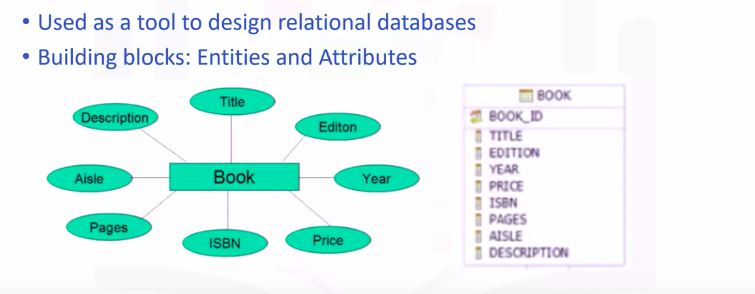</a>
					</p>
			* Attributes are connected to exactly one entity
			* The entity book becomes a table in the database, and the attributes become the columns in a table
		1. Continuing the example above
			* books are written by authors, book is an entity, an author is an entity
			* For the entity author, the ER diagram would look like the image below
			* The entity author has attributes, such as
				1. the author's last name
				1. first name
				1. email
				1. city
				1. country
				1. an author ID to uniquely identify the author
			* The entity author becomes a table in the database, and the attributes become the columns in the table
					<p align="center">
					  <a href="javascript:void(0)" rel="noopener">
						 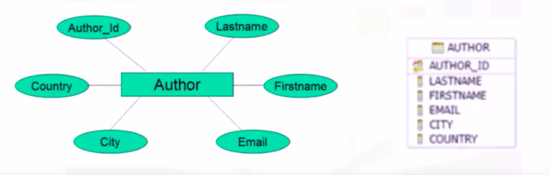</a>
					</p>
	* In the simplified library database, we progress through the process of identifying entities, such as
		1. borrowers who take books out on loan
		1. various copies of each book
		1. copies of books out on loan
					<p align="center">
					  <a href="javascript:void(0)" rel="noopener">
						 </a>
					</p>
			* Each entity becomes a table in the database

#### Summary

* Summary of Lesson
				<p align="center">
				  <a href="javascript:void(0)" rel="noopener">
					 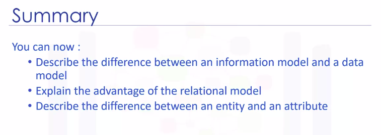</a>
				</p>

### Types of Relationships

* Lecture course_overview
				<p align="center">
				  <a href="javascript:void(0)" rel="noopener">
					 </a>
				</p>
* Building Blocks
	*  The building blocks of a relationship are
		1. __Entities__
			* Entity sets are represented by __a rectangle__
		1. __Relationship Sets__
			* Relationship sets are represented by __a diamond__, with lines connecting associated entities
		1. __Crows Foot Notations__
			* Some of these are the __greater than__ symbol, the __less than__ symbol and a __vertical line__
				<p align="center">
				  <a href="javascript:void(0)" rel="noopener">
					 </a>
				</p>
* Example
	1. An entity relationship diagram or ER diagram for the entity book would look like the image shown below
		1. the entity __book__ is drawn as a rectangle
		1. the attributes are drawn as ovals
				<p align="center">
				  <a href="javascript:void(0)" rel="noopener">
					 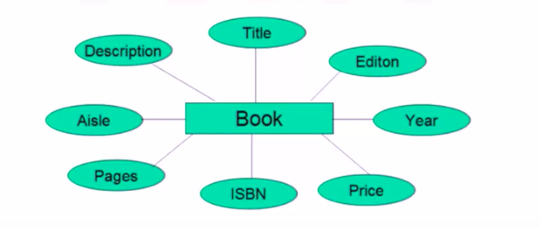</a>
				</p>
			* Attributes are certain properties of that entity, for example title, edition, year, price, etc
		1. Attributes are connected to exactly one entity
	1. For the entity author, the ER diagram would look like the image shown below, the entity author has attributes
		1. last name
		1. first name
		1. email
		1. city
		1. country
		1. author ID
				<p align="center">
				  <a href="javascript:void(0)" rel="noopener">
					 </a>
				</p>
	1. **How the entitys' book and author relate to each other**
		* Cases could be
			1. A book must be written by at least one author
				* However, a book can be written by two authors, and a book can be written by many authors
			1. As another example one author can write just one book, or two books, or multiple books
		* In both cases there is a relationship between the book and the author
		* In our examples we see that the book needs at least an author
			* The relationship set that comes here is authored by
				* One book must be written by one author
			* The thick lines indicate each entity in the entity set is involved in at least one and exactly one relationship
				* This is called a __one-to-one relationship__
					<p align="center">
					  <a href="javascript:void(0)" rel="noopener">
						 </a>
					</p>
		* We stated that more than one author can write a book
			* This can be represented with the different notation called **crow's foot notation**
			* In this case a less than symbol
				* This indicates that one book entity is participating in more than one relationship in the relationship set
					* This is called a __one-to-many relationship__
					* This could also be called a __many-to-one relationship__
						* in that many authors write a single book
							<p align="center">
							  <a href="javascript:void(0)" rel="noopener">
								 </a>
							</p>
		* To represent many authors writing many books use the greater than and less than symbols on either side of the relationship set. This is called a __many-to-many relationship__
			* Each entity in the entity set is participating in more than one relationship
				* Many books being written by many authors, or many authors writing many books
							<p align="center">
							  <a href="javascript:void(0)" rel="noopener">
								 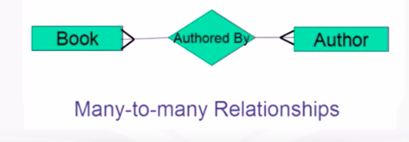</a>
							</p>
* Only entities are used in the relationship diagrams
* Attributes are omitted because they can clutter the diagrams

#### Summary

* Summary of Lesson
				<p align="center">
				  <a href="javascript:void(0)" rel="noopener">
					 </a>
				</p>


### Mapping Entities to Tables

* Lecture course_overview
				<p align="center">
				  <a href="javascript:void(0)" rel="noopener">
					 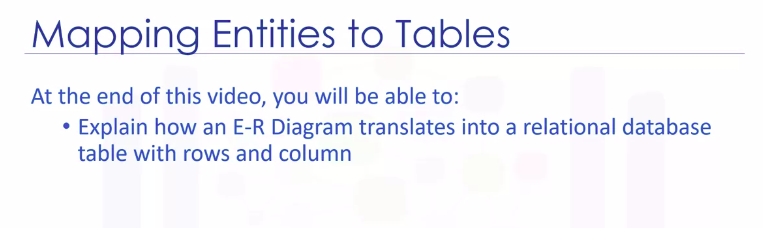</a>
				</p>
* Entity relationship diagrams are the basic foundations for designing a database
* In the relational database design, begin with an ER Diagram, or ERD and later map the ERD to the tables in the database
				<p align="center">
				  <a href="javascript:void(0)" rel="noopener">
					 </a>
				</p>
* Example
	1. We use the ERD for entity book
		* Entity book has several attributes
		* The entity and its attributes will be mapped to a table
		* In this case, entity book becomes a table with the same name, book
		* All the attributes translate into columns in the table
				<p align="center">
				  <a href="javascript:void(0)" rel="noopener">
					 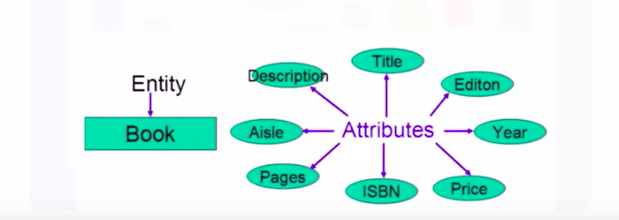</a>
				</p>
	1. How a table is represented in a Relational Database Model
		* A table is a combination of rows and columns
		* While mapping, the entity becomes the table
		* The attributes get translated into columns in a table providing the actual table form of rows and columns
		* Later we add some data values to each of the columns, which completes the table form
			<p align="center">
			  <a href="javascript:void(0)" rel="noopener">
				 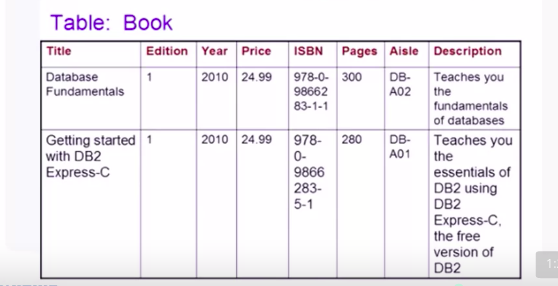</a>
			</p>
	1. Entity Author Example
			<p align="center">
			  <a href="javascript:void(0)" rel="noopener">
				 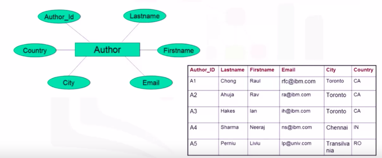</a>
			</p>

#### Summary

* Summary of Lesson
				<p align="center">
				  <a href="javascript:void(0)" rel="noopener">
					 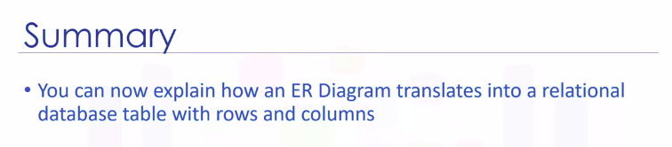</a>
				</p>

### Relational Model Concepts

* Lecture course_overview
				<p align="center">
				  <a href="javascript:void(0)" rel="noopener">
					 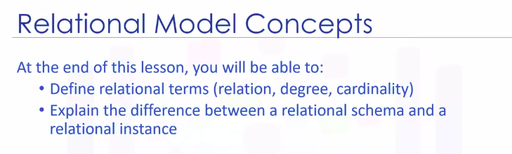</a>
				</p>
* The relational model was first proposed in 1970 and is based on a mathematical model and mathematical terms
* The building blocks of the relational model are
	1. **Relation**
		* The relational model of data is based on the concept of relation
		* A __relation__ is a mathematical concept based on the idea of sets
	1. **Sets**
		* A __set__ is an unordered collection of distinct elements
		* It is a collection of items of the same type
		* It would have no order and no duplicates
* A **relational database** is a **set** of **relations**
	* A **relation** is also the mathematical **term** for a **table**
* A **table** is a combination of rows and columns
* A **relation** is made up of two parts
	1. **Relational Schema**
		* A __relational schema__ specifies the name of a relation and the attributes
		* Example
			* The example here is the entity author
				* Author is the name of the relation
					* Author_ ID is an attribute which can hold the data type char, which is a character string of a fixed length
				* Likewise, lastname, firstname, email and city have the data type varchar, which is a character string of a variable length
				* The last attribute country, also has a data type of char
			* This constitutes the __relational schema__
				<p align="center">
				  <a href="javascript:void(0)" rel="noopener">
					 </a>
				</p>
	1. **Relational Instance**
		* A __relational instance__ is a table made up of the attributes or columns and the tuples or rows
		* The columns are the attributes or fields
		* The rows are tuples
		* __Degree__ refers the number of attributes or columns in a relation
		* __Cardinality__ refers to the number of tuples or rows
		* In the example image below
			* the degree is six because there are six columns
			* the cardinality is five because there are five tuples or rows
				<p align="center">
				  <a href="javascript:void(0)" rel="noopener">
					 </a>
				</p>
* Review Terms
	1. The relational model of data is based on the concept of relation
	1. A relation is a mathematical concept based on idea of sets and is the mathematical term for a table
	1. A relation is made up of two parts: __relational schema__ and __relational instance__
		1. A __relational schema__ specifies the name of a relation and the attributes
		1. A __relational instance__ is a table made up of the attributes or columns and the tuples or rows
	1. __Degree__ refers to the number of attributes or columns in a relation
	1. __Cardinality__ refers to the number of tuples or rows in a relation

#### Summary

* Summary of Lesson
				<p align="center">
				  <a href="javascript:void(0)" rel="noopener">
					 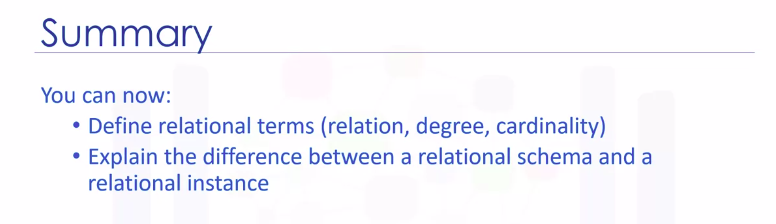</a>
				</p>

