Databases and SQL for Data Science
===================================

by IBM

# Module 2

#
## Title: Introduction to Databases and Basic SQL

## String Patterns, Ranges, Sorting, and Grouping

### Using String Patterns, Ranges

* Lecture overview
				<p align="center">
				  <a href="javascript:void(0)" rel="noopener">
					 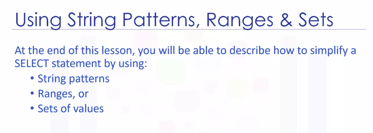</a>
				</p>
* The main purpose of a database management system is not just to store the data, but also facilitate retrieval of the data
				<p align="center">
				  <a href="javascript:void(0)" rel="noopener">
					 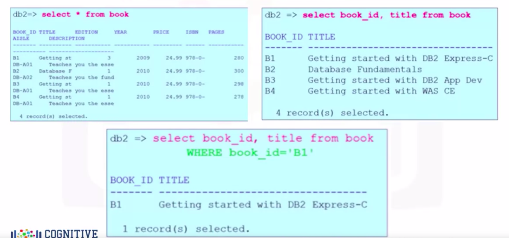</a>
				</p>
		* Based on a simplified library database model and the table book, select star from book gives a result set of four rows
		* All the data rows for all columns in the table book are displayed
			* or you can retrieve a subset of columns.
				* for example, just two columns from the table book such as book_ID and title
			* Or you can restrict the ResultSet by using the WHERE clause
				* For example, you can select the title of the book whose book_ID is B1
* The WHERE clause always requires a predicate, which is a condition that evaluates to true, false or unknown
* What if we don't know exactly what value the predicate is?
	1. String Pattern
		* In a relational database, we can use __string patterns__ to search data rows that match this condition
		* Example of String Patterns
					<p align="center">
					  <a href="javascript:void(0)" rel="noopener">
						 </a>
					</p>
			* If we can't remember the name of the author, but we remember that their name starts with "R", we use the __WHERE__ clause with the __LIKE__ predicate
			* The __LIKE__ predicate is used in a WHERE clause to search for a pattern in a column
				* The __percent sign__ is used to __define missing letters__
				* The __percent sign__ can be placed __before__ the pattern, __after__ the pattern, or __both__ before and after the pattern
				* The __percent sign__ is called a __wildcard character__
					* A __wildcard character__ is used to substitute other characters
			* The query in sample image above will return all rows in the author table whose author's first name starts with the letter "R"
	1. Range
		* In a relational database, we can use a range of numbers to specify the same condition
		* Instead of using the comparison operators greater than or equal to, we use the comparison operator **BETWEEN AND**
			* The values in the range are __inclusive__
		* Example of Range
			* If we wanted to retrieve the list of books whose number of pages is more than 290, but less than 300
					<p align="center">
					  <a href="javascript:void(0)" rel="noopener">
						 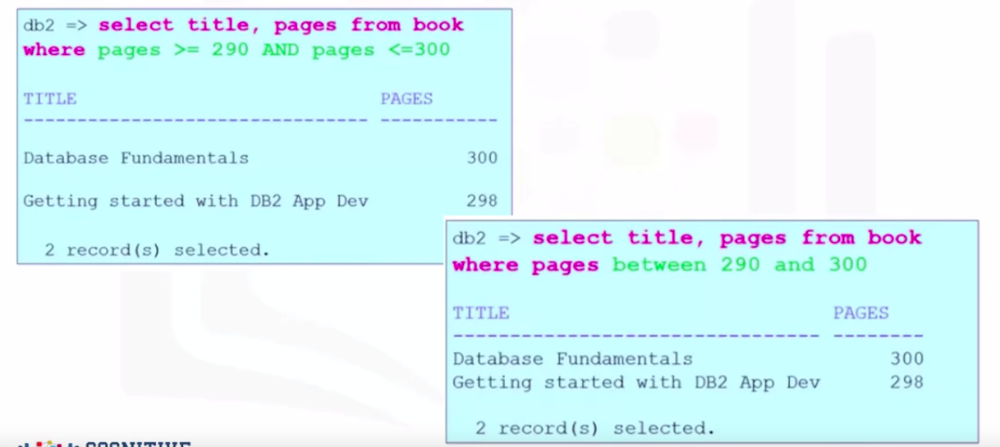</a>
					</p>
	1. Set of Values
		* In some cases, there are data values that cannot be grouped under ranges
		* The __IN__ operator allows us to specify a set of values in a __WHERE__ clause
			* This operator takes a list of expressions to compare against
		* Example of Set of Values
			* what if we want to retrieve authors from Canada, India, and China?
				* The WHERE clause would become very long repeatedly listing the required country conditions
				* we can use the __IN__ operator
					<p align="center">
					  <a href="javascript:void(0)" rel="noopener">
						 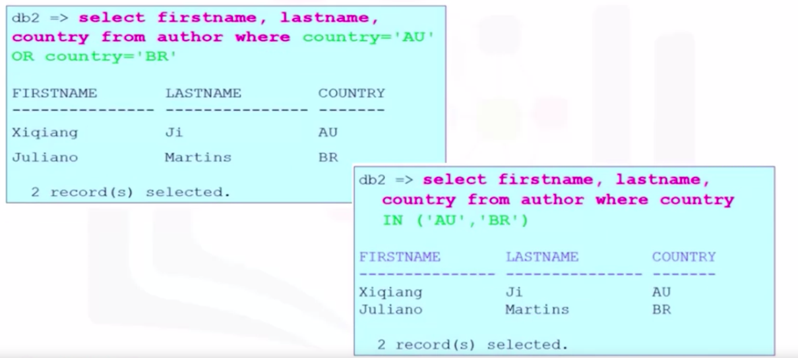</a>
					</p>

#### Summary

* Summary of Lesson
				<p align="center">
				  <a href="javascript:void(0)" rel="noopener">
					 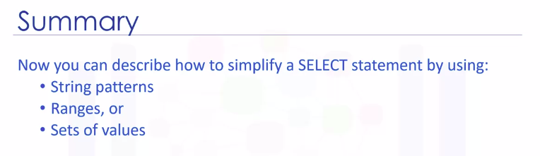</a>
				</p>

### Sorting Result Sets

* Lecture overview
				<p align="center">
				  <a href="javascript:void(0)" rel="noopener">
					 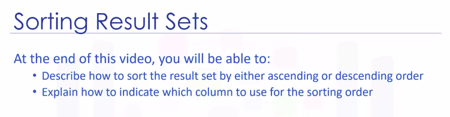</a>
				</p>
* The main purpose of a database management system is not just to store the data, but also facilitate retrieval of the data
* Displaying the results set in alphabetical order would make the result set more convenient
	* To do this, we use the __ORDER BY__ clause
* To display the result set in alphabetical order, we add the order by clause to the select statement
* The __ORDER BY__ clause is used in a query to sort the result set by a specified column
	* By __default__, the result set is sorted in __ascending order__
	* To sort in descending order, use the key word __DESC__
* For Example
	1. In this example, we have used order by on the column title to sort the result set
				<p align="center">
				  <a href="javascript:void(0)" rel="noopener">
					 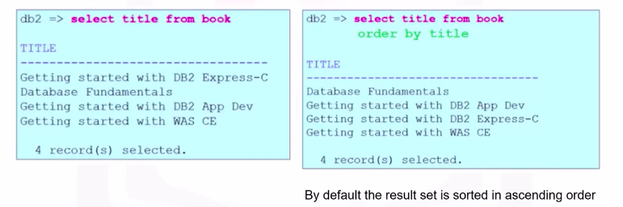</a>
				</p>
		* To sort result set in descending order use the keywork DESC in ORDER BY clause, as shown in image below
				<p align="center">
				  <a href="javascript:void(0)" rel="noopener">
					 </a>
				</p>
			* __Notice__ the order of the first three rows. The first three words of the title are the same, so the sorting starts from the point where the characters differ
	1. Specifying Column Sequence number for Sorting
		* Instead of specifying the column name pages, the number two is used
		* In the select statement, the second column specified in the column list is pages, so the sort order is based on the values in the pages column
				<p align="center">
				  <a href="javascript:void(0)" rel="noopener">
					 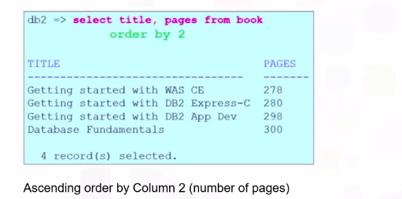</a>
				</p>

#### Summary

* Summary of Lesson
				<p align="center">
				  <a href="javascript:void(0)" rel="noopener">
					 </a>
				</p>

### Grouping Result Sets

* Lecture overview
				<p align="center">
				  <a href="javascript:void(0)" rel="noopener">
					 </a>
				</p>
* At times, a select statement result set can contain duplicate values
* __DISTINCT__ Clause
	* To eliminate duplicates, we use the keyword __distinct__
	* 
	* Example
		1. We need is a list of countries the authors come from
				<p align="center">
				  <a href="javascript:void(0)" rel="noopener">
					 </a>
				</p>
* __GROUP BY__ Clause
	* The __GROUP BY__ clause groups a result into subsets that has matching values for one or more columns
	* Example
		1. if we wanted to also know how many authors come from the same country?
			* To display the result set listing the country and number of authors that come from that country, we add the __group by__ clause to the select statement
					<p align="center">
					  <a href="javascript:void(0)" rel="noopener">
						 </a>
					</p>
				* Notice the column heading for the second column and the result set
					* The numeric value "2" displays as a column name because the column name is not directly available in the table
					* The second column in the result set was calculated by the count function
				* Instead of using the column named "2," we can assign a column name to the result set
					* We do this using the __AS__ keyword. In this example, we change the derived column name "2" to column name __Count__ using the __AS count__ keyword
* __HAVING__ Clause
	* To set a condition to a __GROUP BY__ clause, we use the keyword __HAVING__
	* The __HAVING__ clause is used in combination with the __GROUP BY__ clause
	* It is very important to note that the __WHERE__ clause is for the entire result set, but the __HAVING__ clause works only with the __GROUP BY__ clause
	* Example of Having Clause
		* we can check if there are more than four authors from the same country
					<p align="center">
					  <a href="javascript:void(0)" rel="noopener">
						 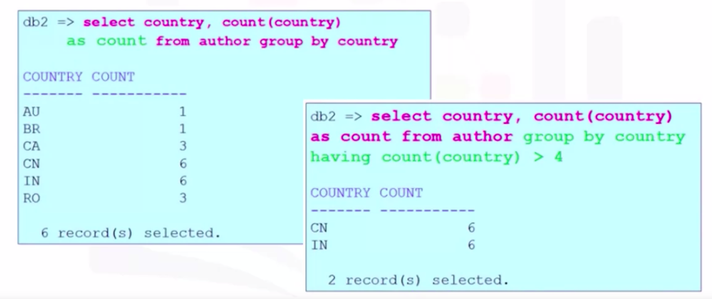</a>
					</p>

#### Summary

* Summary of Lesson
				<p align="center">
				  <a href="javascript:void(0)" rel="noopener">
					 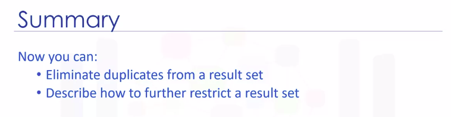</a>
				</p>

## Functions, Sub-Queries, Multiple Tables

### Built-in Database Functions

* Most databases come with Built-in Functions
* Built-in functions can be included in SQL statements, allowing you to perform operations on data right within the database itself
* Using database functions can significantly reduce the amount of data that needs to be retrieved from the database
	* That is, they reduce both network traffic and use of bandwidth
* When working with large data sets, it may be faster to use built in functions, rather than first retrieving the data into your application and then executing functions on the retrieved data
* It's also possible to create your own functions, known as __User-Defined Functions__ in the database
* Types of Functions in Database
	1. Built-in Functions
	1. User Defined Functions
* Example Table to be used in this lecture
	* The table records sale transaction details and includes the columns: ID, animal, quantity, sale price, and sale date
				<p align="center">
				  <a href="javascript:void(0)" rel="noopener">
					 </a>
				</p>
* __Aggregate__ or __Column__ Functions
	* An __aggregate__ function takes a collection of light values, such as all of the values in a column, as input, and returns a single value or null
		* Example of aggregate function
			1. Sum - SUM()
				* A __Sum__ function is used to add up all the values in a column
				* To use the function, you write down the column name within parenthesis, after the function name, like __SUM(COLUMN_NAME)__
				* Example
					* Add up all the values in the SALESPRICE column
						```SQL
						>>> SELECT SUM(SALESPRICE) from PETSALE
						```
				* When you use an aggregate function, the column in the result set by default is given a number
				* It is possible to explicitly name the resulting column
				* let's say we want to call the output column in the previous query, as SUM_OF_SALEPRICE
					```SQL
					>>> SELECT SUM(SALESPRICE) AS SUM_OF_SALEPRICE from PETSALE
					```
			1. Minimum - MIN()
				* __Minimum__, as the name implies, is used to get the lowest value
				* Example
					* Get the minimum quantity of the ID column for dogs
						```SQL
						>>> SELECT MIN(ID) from PETSALE where ANIMAL = 'dog'
						```
			1. Maximum - MAX()
				* __Maximum__ is used to get the highest value
				* Example
					* Get the maximum quantity of any animal sold in a single transaction
						```SQL
						>>> SELECT MAX(QUANTITY) from PETSALE
						```
			1. Average - AVG()
				* The average function is used to return the average or the mean value
				* Example
					* Specify the average value of sale price
						```SQL
						>>> SELECT AVG(SALEPRICE) from PETSALE
						```
				* Example
					* Calculate the average sale price per dog
						* In this case, the sale price is for multiple units; so we first divide the sale price by the quantity of the sale
							```SQL
							>>> select AVG(SALEPRICE / QUANTITY) from PETSALE where ANIMAL = 'dog'
							```
	* __Aggregate functions__ can also be applied on a subset of data instead of an entire column
	* __Note__ that we can perform mathematical operations between columns, and then apply aggregate functions on them
* __SCALAR__ and __STRING__ Functions
	* __SCALAR Functions__
		* __Scalar Functions__ perform operations on individual values
		* For example
			* Round up or down every value in the sale price column to the nearest integer
				```SQL
				>>> SELECT ROUND(SALEPRICE) from PETSALE
				```
		* There is a class of scalar functions called __String Functions__, that can be used for operations on strings
			* That is __char__ and __varchar__ values
			* Example
				* Retrieve the length of each value in the animal column
					```SQL
					>>> SELECT LENGTH(SALEPRICE) from PETSALE
					```
* __UPPER CASE__ and __LOWER CASE__ Functions
	* Uppercase and Lowercase functions can be used to return uppercase or lowercase values of strings
	* For example
		* Retrieve animal values in uppercase
			```SQL
			>>> SELECT UCASE(ANIMAL) from PETSALE
			```
	* Scalar functions can be used in the where clause
		* Example
			* Get lowercase values of the animal column for cat
				```SQL
				>>> SELECT * from PETSALE
				>>> 	where LCASE(ANIMAL)='cat'
				```
	* This type of statement is useful for matching values in the where clause, if you're not sure whether the values are stored in upper, lower or mixed case in the table
	* You can also have one function operate on the output of another function
	* Example
		* Get unique values for the animal column and uppercase
			```SQL
			>>> SELECT DISTINCT(UCASE(ANIMAL)) from PETSALE
			```

### Date and Time Built-in Functions

* Example Table to be used in this lecture
	* The table records sale transaction details and includes the columns: ID, animal, quantity, sale price, and sale date
				<p align="center">
				  <a href="javascript:void(0)" rel="noopener">
					 </a>
				</p>
* Most databases contain special data types for dates and times
* Db2 contains
	1. date type
	1. time type
	1. timestamp type
* In Db2, 
	* __Date__ has eight digits: for year, month, and day
	* __Time__ has six digits: hours, minutes, and seconds
	* __Timestamp__ has 20 digits: year, month, day, hour, minute, seconds, and microseconds
		* where double X represents the month and six Z's or Z represents microseconds
	* Functions exist to extract
		1. the day
		1. month
		1. day of month
		1. day of week
		1. day of year
		1. week
		1. hour
		1. minute
		1. second
				<p align="center">
				  <a href="javascript:void(0)" rel="noopener">
					 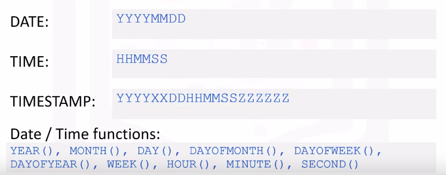</a>
				</p>
* DAY() Function
	* The DAY() function can be used to extract the day portion from a date
	* Example
		* Get the day portion for each sale date involving cat
			```SQL
			>>> SELECT DAY(SALEDATE) from PETSALE
			>>> 	WHERE ANIMAL='cat'
			```
* Date and time functions can be used in the where clause
	* Example
		* Get the number of sales during the month of May, i.e. Month 5
			```SQL
			>>> SELECT COUNT(*) from PETSALE
			>>> 	WHERE MONTH(SALEDATE) = '05'
			```
* You can also perform date or time arithmetic
	* Example
		* let's say you wanted to know what the date was three days after each sale date because each order needs to be processed within three days
			```SQL
			>>> SELECT (SALEDATE + 3 DAYS) from PETSALE
			```
* Special registers for __CURRENT_DATE__ and __CURRENT_TIME__ are also available
	* For example
		* Find how many days have passed since each sale date till now
			```SQL
			>>> SELECT (CURRENT_DATE - SALEDATE) from PETSALE
				10921 ## 1 - year, 09 - Month, 21 - Day
			```

### Sub-Queries and Nested Selects

* Sub-queries or sub selects are like regular queries but placed within parentheses and nested inside another query
* This allows you to form more powerful queries than would have been otherwise possible
* Syntax of Sub-query
				<p align="center">
				  <a href="javascript:void(0)" rel="noopener">
					 </a>
				</p>
* Example
	* Sample Data
		* The table contains several columns, including an employee ID, first name, last name, salary, etc
				<p align="center">
				  <a href="javascript:void(0)" rel="noopener">
					 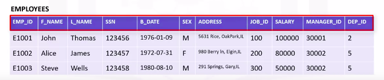</a>
				</p>
	1. We want to retrieve the list of employees who earn more than the average salary
		* One of the limitations of built in aggregate functions, like the average function, is that they cannot always be evaluated in the WHERE clause
			```SQL
			>>> SELECT * from employees
			>>> 	WHERE salary > AVG(salary)
				OUTPUT: ERROR SHOWN IN IMAGE BELOW
			```
			<p align="center">
			  <a href="javascript:void(0)" rel="noopener">
				 </a>
			</p>
		* So to evaluate a function like average in the WHERE clause, we can make use of a sub-select expression
			```SQL
			>>> SELECT EMP_ID, F_NAME, L_NAME, SALARY
			>>> 	from employees
			>>> 	WHERE salary < ( SELECT AVG(SALARY) from employees )
			```
		* __Notice__ that the average function is evaluated in the first part of the sub-query
* __Column Expressions__
	* The sub-select doesn't just have to go in the WHERE clause
		* It can also go in other parts of the query, such as in the list of columns to be selected
		* Such sub-queries are called __Column Expressions__
	* Example
		* We wanted to compare the salary of each employee with the average salary
			```SQL
			>>> select EMP_ID, SALARY, ( select AVG(SALARY) from employees ) AS AVG_SALARY from employees
			```
* Sub-queries in FROM Clause
	* Substitute the Table name with sub-query
		* Sub-queries like these are sometimes called __Derived Tables__ or __Table Expressions__
		* Because the outer query uses the results of the sub-query as a data source
	* Example
		* The derived table in a sub-query does not include sensitive fields like date of birth or salary
			```SQL
			>>> select * from (select EMP_ID, F_NAME, L_NAME, DEP_ID from employees) AS EMP4ALL
			```
	* Such derived tables can prove to be powerful in more complex situations such as when working with multiple tables and doing joins

### Working with Multiple Tables

* There are several ways to access multiple tables in the same query
	1. Sub-queries
	1. Implicit JOIN
	1. JOIN operators, such as INNER JOIN, OUTER JOIN, etc
* Example Table to be used in this lecture
			<p align="center">
			  <a href="javascript:void(0)" rel="noopener">
				 </a>
			</p>
* Example
	1. If we want to retrieve only the employee records from the employees table for which a department ID exists in the departments table
		* Here the outer query accesses the employees table and the sub-query on the departments table is used for filtering the result set of the outer query
			```SQL
			>>> select * from employees 
			>>> 	where DEP_ID IN
			>>>			( select DEPT_ID_DEP from departments ) ;
			```
	1. Let's say we want to retrieve only the list of employees from a specific location
		* We do not have any location information in the employees table, but the departments table has a column called location ID
		* Therefore, we can use a sub-query from the Departments table as input to the employee table query
			```SQL
			>>> select * from employees
			>>> 	where DEP_ID IN
			>>>			( select DEPT_ID_DEP from departments
			>>> 			WHERE LOC_ID = 'L0002' ) ;
			```
	1. Let's retrieve the department ID and department name for employees who earn more than $70,000
		* To do so, we will need a sub-query on the employees table to satisfy the salary criteria, and then feed it as input to an outer query on the departments table in order to get the matching department info
			```SQL
			>>> select DEPT_ID_DEP, DEP_NAME from departments
			>>> 	WHERE DEPT_ID_DEP IN
			>>>			( select DEP_ID from employees 
			>>> 			WHERE SALARY > 70000 )
			```
* We can also access multiple tables by specifying them in the FROM clause of the query
	* Example
		* Here we specify two tables in the FROM clause
		* This results in a table join, but note we are not explicitly using the join operator
			* The resulting join in this example is called a __Full Join__ or __Cartesian Join__
				* because every row in the first table is joined with every row in the second table
					```SQL
					>>> select * from employees, departments
					```
		* We can use additional operands to limit the result set
			* Let's look at an example where we limit the result set to only rows with matching department IDs
					```SQL
					>>> select * from employees, departments
					>>> 	WHERE employees.DEP_ID = departments.DEPT_ID_DEP;
					```
			* __Notice__ that in the WHERE clause, we prefix the name of the column with the name of the table
				* This is to fully qualify the column name, since it's possible that different tables could have some column names that are exactly the same
		* Since the table names can sometimes be long, we can use shorter aliases for table names
					```SQL
					>>> select * from employees E, departments D
					>>> 	WHERE E.DEP_ID = D.DEPT_ID_DEP;
					```
			* Here, we define the alias E for employees table and D for departments table, and then use these aliases in the WHERE clause
* If we wanted to see the department name for each employee
		```SQL
		>>> select employees.EMP_ID, departments.DEPT_NAME
		>>> from employees E, departments D
		>>> 	WHERE E.DEP_ID = D.DEPT_ID_DEP;
		```
	* the column names in the select clause can also be prefixed by aliases as shown in the query
		```SQL
		>>> select E.EMP_ID, D.DEPT_NAME
		>>> from employees E, departments D
		>>> 	WHERE E.DEP_ID = D.DEPT_ID_DEP;
		```

## OPTIONAL: Relational Model Constraints

### Relational Model Constraints

* Lecture overview
				<p align="center">
				  <a href="javascript:void(0)" rel="noopener">
					 </a>
				</p>
* Within any business, data must adhere to certain restrictions or rules
* We will use the book and author example
	* At least one author writes one book
		* This is a one to one relationship
				<p align="center">
				  <a href="javascript:void(0)" rel="noopener">
					 </a>
				</p>
* __Referencing__
	* To look up the author information, the book entity refers to the author entity
	* To look up the book information, the author entity refers to the book entity
	* In a relational data model, this is called __referencing__
* In relational databases, referencing establishes the data integrity between two relations
* Entity-Relationship diagram below, represents the relational data model for the author entity and book entity as part of a simplified library database model
	* Other entities have been added such as borrower, loan, copy, and author list
	* __Notice__ that the attributes author underscore Id, book underscore Id, and borrower underscore Id, have a special icon
		* This identifies the primary key
	* A __primary key__ of a relational table uniquely identifies each row in a table
	* __Notice__ the entities on the lower half of the screen, some attributes have FK in brackets next to them
		* For example, the copy entity has attribute book underscore Id with the FK in brackets
		* This identifies the foreign key
	* A __Foreign Key__ is a set of columns referring to a primary key of another table
				<p align="center">
				  <a href="javascript:void(0)" rel="noopener">
					 </a>
				</p>
	* These entities are part of the relationship set between the entities above them
	* All of the entities have a one to many relationship established between them
* A table containing a primary key that is related to at least one foreign key is called a __Parent Table__
	* In the example, the __author entity__ is the __parent table__
	* The __book entity__ is also a __parent table__
* A table containing one or more foreign keys is called a __Dependent Table__
	* It might also be referred to as a __Child Table__
	* In the example, the __author_list entity__ has foreign keys that refer to different parent tables, __author__ and __book__

#### Summary

* Summary of Lesson
				<p align="center">
				  <a href="javascript:void(0)" rel="noopener">
					 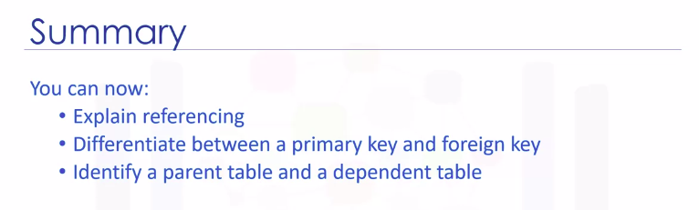</a>
				</p>

### Relational Model Constraints - Advanced

* Lecture overview
				<p align="center">
				  <a href="javascript:void(0)" rel="noopener">
					 </a>
				</p>
* Within any business, data must often adhere to certain restrictions or rules
* __Constraints__
	* __Constraints__ help implement the business rules
	* In a relational data model, data integrity can be achieved using __integrity rules__ or __constraints__
	* The following six constraints are defined in a relational database model
		1. __Entity integrity constraint
			* The __entity integrity__ constraint states that no attribute participating in the primary key of a relation is allowed to accept null values
			* To identify each topple in a relation, the relation must have a primary key
				* The __primary key__ is a unique value that identifies each topple or row in a table
				* This is the entity integrity constraint
			* The terms __primary__ and __key constraint__ or __unique constraint__ are also used
			* This constraint prevents duplicate values in a table
			* To implement these constraints, indexes are used
			* The value null indicates that the value is unknown
			* In the entity integrity constraint, the primary key cannot have an unknown value
			* With the entity integrity constraint, no attribute participating in the primary key is allowed to accept null values
		1. __Referential Integrity Constraint__
			* __Referential integrity__ constraint defines relationships between tables and ensures that these __relationships remain valid__
			* The validity of the data is enforced using a combination of __primary keys__ and __foreign keys__
			* Example
				* for a book to exist, it has to be written by at least one author
		1. __Semantic Integrity Constraint__
			* The __semantic integrity__ constraint refers to the __correctness__ of the meaning of the data
			* For example
				* in the relation author, if the attribute or column city contains a garbage value instead of Toronto, the garbage value does not have any meaning
			* The semantic integrity constraint is related to the correctness of the data
		1. __Domain Constraint__
			* A __domain constraint__ specifies the permissible values for a given attribute
			* For example
				* in the relation author, the attribute country must contain a two letter country code such as CA for Canada or IN for India
					* If a number value of 34 is entered for the country attribute instead of a two letter country code, the value 34 does not have any meaning
		1. __Null Constraint__
			* The __null constraint__ specifies that attribute values cannot be null
			* For example
				* in the relation author, if either last name or first name contains a null value, it could be difficult to identify the correct author
		1. __Check Constraint__
			* The __check constraint__ enforces __domain integrity__ by limiting the values that are accepted by an attribute

#### Summary

* Summary of Lesson
				<p align="center">
				  <a href="javascript:void(0)" rel="noopener">
					 </a>
				</p>

