Databases and SQL for Data Science
===================================

by IBM

# Module 3

#
## Title: Introduction to Databases and Basic SQL

## Accessing databases using Python

### How to Access Databases Using Python

* __Benefits of Python for Database Programming__
	* The Python ecosystem is very rich and provides easy to use tools for data science
	* Some of the most popular packages are NumPy, pandas, matplotlib, and SciPy
	* Python is easy to learn and has a simple syntax
	* Due to its open source nature, Python has been ported to many platforms
	* All your python programs can work on any of these platforms without requiring any changes at all, if you are careful and avoid any system dependent features
	* Python supports relational database systems
	* Writing Python code to access databases is made easier by the presence of the Python database API
		* Commonly referred to as the DB API, and detailed documentation related to Python is easily available
				<p align="center">
				  <a href="javascript:void(0)" rel="noopener">
					 </a>
				</p>
* __Introduction to Notebooks__
	* __Notebooks__ are also very popular in the field of data science because they run in an environment that allows creation and sharing of documents that contain __live code__, __equations__, __visualizations__, and __explanatory texts__
	* A notebook interface is a virtual notebook environment used for programming
	* Examples of notebook interfaces include 
		1. the mathematical notebook
		1. Maple worksheet
		1. Matlab notebook
		1. IPython Jupyter
		1. R Markdown
		1. Apache Zeppelin
		1. Apache Spark notebook
		1. the Databricks cloud
				<p align="center">
				  <a href="javascript:void(0)" rel="noopener">
					 </a>
				</p>
* __Jupyter Notebook__
	* The Jupyter notebook is an open source web application that allows you to create and share documents that contain live code, equations, visualizations, and narrative texts
	* __Advantages__
		1. Notebook support for over 40 programming languages including Python, R, Julia, and Scala
		1. Notebooks can be shared with others by email, Dropbox, GitHub, and the Jupyter notebook viewer
		1. Your code can produce rich interactive output HTML, images, videos lay tech, and customized types
		1. You can leverage big data tools such as Apache Spark from Python, R, and Scala, and explore that same data with pandas, scikit-learn, ggplot2, and TensorFlow
* __Accessing database using Python__
	* This is how a typical user accesses databases using Python code written on a Jupyter notebook, a web based editor
				<p align="center">
				  <a href="javascript:void(0)" rel="noopener">
					 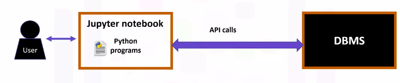</a>
				</p>
	* There is a mechanism by which the Python program communicates with the DBMS
	* The Python code connects to the database using API calls
* __SQL API__
	* An application programming interface is a set of functions that you can call to get access to some type of servers
	* The SQL API consists of library function calls as an application programming interface, API, for the DBMS
				<p align="center">
				  <a href="javascript:void(0)" rel="noopener">
					 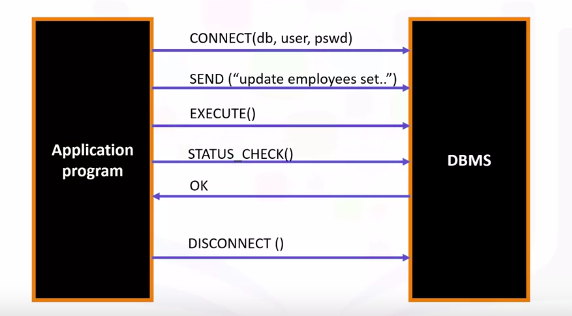</a>
				</p>
	* To pass SQL statements to the DBMS, an application program calls functions in the API, and it calls other functions to retrieve query results and status information from the DBMS
	* __Basic Operations of a typical SQL API__ (as shown in image above)
		* The application program begins its database access with one or more API calls that connect the program to the DBMS
		* To send the SQL statement to the DBMS, the program builds the statement as a text string in a buffer and then makes an API call to pass the buffer contents to the DBMS
		* The application program makes API calls to check the status of its DBMS request and to handle errors
		* The application program ends its database access with an API call that disconnects it from the database
* __API's used by popular SQL-based DBMS systems__
	* __MySQL C API__ provides low level access to the MySQL client server protocol and enable C programs to access database contents
	* The __psycopg2__ API connects Python applications in PostgreSQL databases
	* The __IBM_DB API__ is used to connect Python applications to IBM DB2 databases
	* The __dblib API__ is used to connect to SQL server databases
	* __ODBC__ is used for database access for Microsoft Windows OS
	* __OCI__ is used by Oracle databases
	* __JDBC__ is used by Java applications
				<p align="center">
				  <a href="javascript:void(0)" rel="noopener">
					 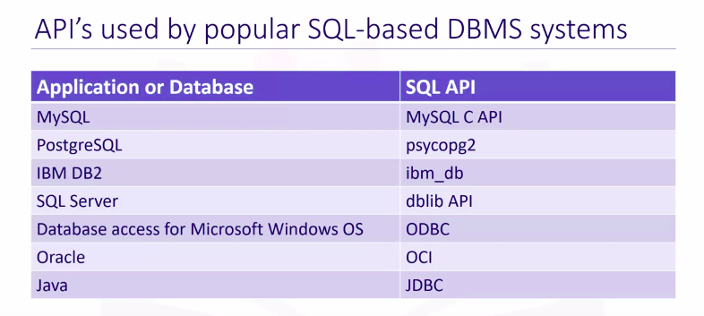</a>
				</p>

### Writing code using DB-API

* __What is a DB-API__
	* The Python code connects to the database using DB-API calls
	* DB-API is Python's standard API for accessing relational databases
	* It is a standard that allows you to write a single program that works with multiple kinds of relational databases instead of writing a separate program for each one
				<p align="center">
				  <a href="javascript:void(0)" rel="noopener">
					 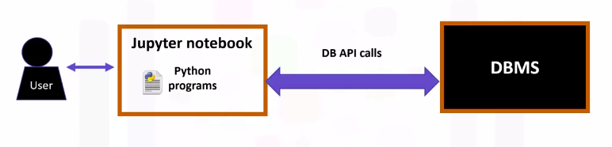</a>
				</p>
* __Advantages DB-API__
	1. It's easy to implement and understand
	1. This API has been defined to encourage similarity between the Python modules that are used to access databases
	1. It achieves consistency which leads to more easily understood modules
	1. The code is generally more portable across databases, and it has a broader reach of database connectivity from Python
* __Libraries used by database systems to connect to Python Applications__
	* The Ibm_db library is used to connect to a DB2 Warehouse on Cloud database
	* The MySQL Connector/Python library is used to connect to a Compose for MySQL database
	* The psycopg2 library is used to connect to a Compose from PostgreSQL database
	* the PyMongo library is used to connect to a Compose for MongoDB database
				<p align="center">
				  <a href="javascript:void(0)" rel="noopener">
					 </a>
				</p>
* The two main concepts in the Python DB-API are
	1. __Connection objects__
		* __Connection objects__ are used to connect to a database and manage your transactions
	1. __Cursor objects__
		* __Cursor objects__ are used to run queries. You open a cursor object and then run queries
		* The cursor works similar to a cursor in a text processing system where you scroll down in your result set and get your data into the application
		* Cursors are used to scan through the results of a database
* __Connection Object methods__
	1. The __cursor()__ method returns a new cursor object using the connection
	1. The __commit()__ method is used to commit any pending transaction to the database
	1. The __rollback()__ method causes the database to roll back to the start of any pending transaction
	1. The __close()__ method is used to close a database connection
* __Cursor Object methods__
	* These objects represent a database cursor which is used to manage the content of a fetch operation
		1. callproc()
		1. execute()
		1. executemany()
		1. fetchone()
		1. fetchmany()
		1. fetchall()
		1. nextset()
		1. Arraysize()
		1. close()
	* Cursors created from the same connection are not isolated i.e. any changes done to the database by a cursor are immediately visible by the other cursors
	* Cursors created from different connections can or cannot be isolated depending on how the transaction support is implemented
* __What is a Database Cursor?__
	* A database cursor is a control structure that enables traversal over the records in a database
	* It behaves like a file name or file handle in a programming language
	* Just as a program opens a filed accesses files contents, it opens a cursor to gain access to the query results
	* Similarly, the program closes a file to end its access and closes a cursor to end access to the query results
	* Another similarity is that just as file handle keeps track of the program's current position within an open file, a cursor keeps track of the program's current position within the query results
* __Code sample using DB-API__
	* First, you import your database module by using the connect API from that module
	* To open a connection to the database, you use the connection function and pass in the parameters that is the database name, username, and password
	* The connect function returns connection object
	* After this, you create a cursor object on the connection object
	* The cursor is used to run queries and fetch results
	* After running the queries using the cursor, we also use the cursor to fetch the results of the query
	* Finally, when the system is done running the queries, it frees all resources by closing the connection
	* __Remember__ that it is always important to close connections to avoid unused connections taking up resources
				<p align="center">
				  <a href="javascript:void(0)" rel="noopener">
					 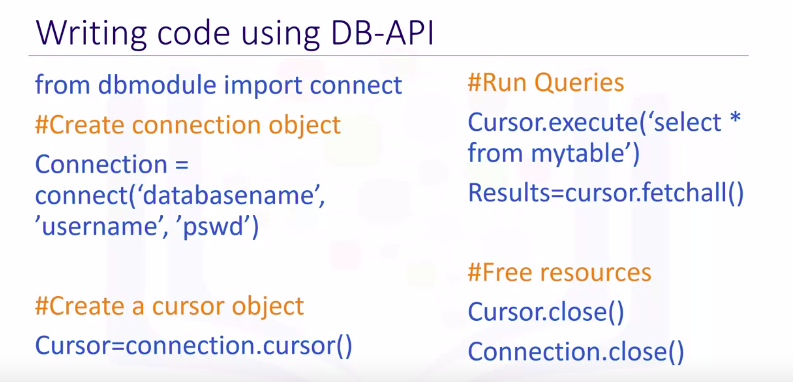</a>
				</p>

### Connecting to a database using ibm_db API

* The ibm_db API provides a variety of useful Python functions for accessing and manipulating data in an IBM data server database, including functions for 
	1. connecting to a database
	1. preparing and issuing sequel statements
	1. fetching rows from result sets
	1. calling stored procedures
	1. committing
	1. rolling back transactions
	1. handling errors
	1. retrieving metadata
* The ibm_db API uses the IBM Data Server Driver for ODBC, and CLI APIs to connect to IBM, DB2, and Informix
* We import the ibm_db library into our Python application
	```python
	>>> import ibm_db
	```
* Connecting to the DB2 warehouse requires the following information
	1. a driver name
	1. a database name
	1. a host DNS name or IP address
	1. a host port
	1. a connection protocol
	1. a user ID
	1. a user password
				<p align="center">
				  <a href="javascript:void(0)" rel="noopener">
					 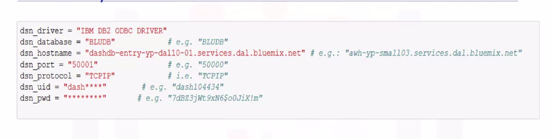</a>
				</p>
* We create a connection object DSN, which stores the connection credentials
* The connect function of the ibm_db API will be used to create a non persistent connection
* The DSN object is passed as a parameter to the connection function
* If a connection has been established with the database, then the code returns connected, as the output otherwise, the output will be unable to connect to database
				<p align="center">
				  <a href="javascript:void(0)" rel="noopener">
					 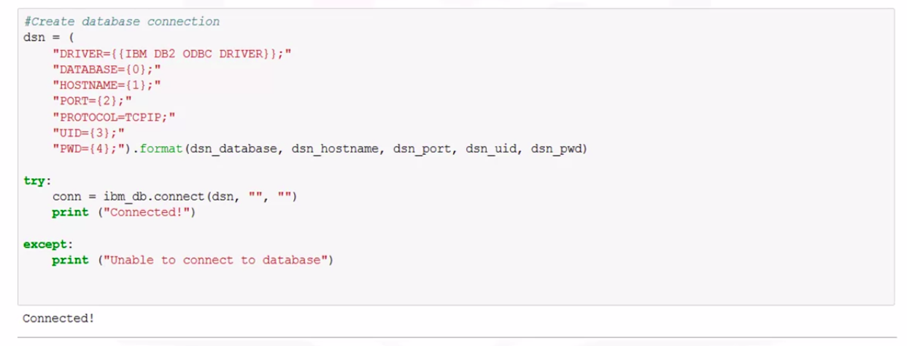</a>
				</p>
* Then we free all resources by closing the connection
* __Remember__ that it is always important to close connections so that we can avoid unused connections taking up resources
				<p align="center">
				  <a href="javascript:void(0)" rel="noopener">
					 </a>
				</p>

### Creating tables, loading data and querying data

* We first obtain a connection resource by connecting to the database by using the connect method of the ibm_db api
* There are different ways of creating tables in DB2 Warehouse
	1. One is using the Web console provided by DB2 Warehouse
	1. the other option is to create tables from any SQL, R, our Python environments
* Sample Trucks Table
				<p align="center">
				  <a href="javascript:void(0)" rel="noopener">
					 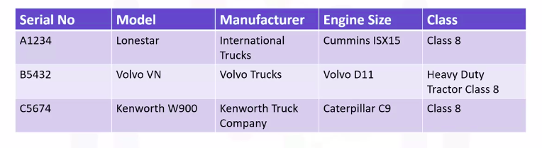</a>
				</p>
* To create a table, we use the __ibm_db.exec_immediate__ function
* The parameters for the function are 
	1. __connection__, which is a valid database connection resource that is returned from the ibm_dbconnect or ibm_dbpconnect function
	1. __statement__, which is a string that contains the sequel statement
	1. __options__ which is an optional parameter that includes a dictionary that specifies the type of cursor to return for results sets
* __Sample code to Create table Trucks in Python__
				<p align="center">
				  <a href="javascript:void(0)" rel="noopener">
					 </a>
				</p>
	* We use the __ibm_db.exec_immediate__ function of the ibm_db api
	* The connection resource that was created passes the first parameter to this function
	* The next parameter is the sequel statement, which is the create table query used to create the trucks table
	* The new table created will have five columns, serial_no will be the primary key
* __Sample code to Load data to the Table__
	* We use the __ibm_db.exec_immediate__ function of the ibm_db api
				<p align="center">
				  <a href="javascript:void(0)" rel="noopener">
					 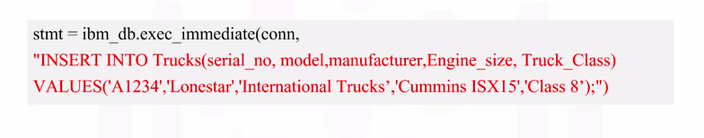</a>
				</p>
	* The connection resource that was created is passes the first parameter to this function
	* The next parameter is the sequal statement, which is the insert into query query used to insert data in the truck's table
		* A new row will be added to the trucks table
	* Similarly, we add more rows to the trucks table using the __ibm_db.exec_immediate__ function
* __Sample code to Query Data using Python__
	* We use the __ibm_db.exec_immediate__ function of the ibm_db api
	* The connection resource that was created is passes the first parameter to this function
	* The next parameter is the sequel statement, which is the select from table query
	* The Python code returns the output, which shows the fields of the data in the truck's table
				<p align="center">
				  <a href="javascript:void(0)" rel="noopener">
					 </a>
				</p>
	* You can check if the output returned by the select query shown is correct, by referring to the DB2 Warehouse console
				<p align="center">
				  <a href="javascript:void(0)" rel="noopener">
					 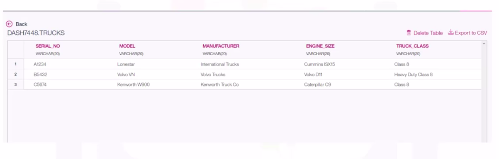</a>
				</p>
* __Using Pandas__
	* Pandas is a popular Python library that contains high level data structures and manipulation tools designed to make data analysis fast and easy in Python
	* We load data from the trucks table into a data frame called DF
	* A data frame represents a tabular spreadsheet like data structure containing an ordered collection of columns, each of which can be a different value type
				<p align="center">
				  <a href="javascript:void(0)" rel="noopener">
					 </a>
				</p>

### Analyzing data with Python

* We will be using the McDonald's menu nutritional facts data for popular menu items at McDonald's, while using Python to perform basic exploratory analysis
* McDonald's is an American fast food company and the world's largest restaurant chain by revenue
* Although McDonald's is known for fast food items such as hamburgers, French fries, soft drinks, milkshakes, and desserts, the company has added to its menu salads, fish, smoothies, and fruit
* McDonald's provides nutrition analysis of their menu items to help you balance your McDonald's meal with other foods you eat
* The data set used in this lesson has been obtained from the nutritional facts for McDonald's menu from __Kaggle__
* There are four steps involved in loading data into a table
	1. source
	1. target
	1. define
	1. finalize
* Steps to Load data in Db2
	* We first load the spreadsheet into the Db2 Warehouse using the console.
	* We then select the target schema, and then you will be given an option to load the data into an existing table or create a new table
	* When you choose to create a new table, you have the option to specify the table name
	* Next, you will see a preview of the data where you can also define the columns and data types
	* Review the settings and begin the load
	* When the loading is complete, you can see the statistics on the loaded data
	* View the table to explore further
* Db2 Warehouse allows you to analyze data using in-database analytics, APIs, RStudio or Python
* Using Pandas
	* We load data from the McDonald's underscore nutrition table into the data frame DF using the read_sql method
	* We can view the first few rows of the data frame DF that we created using the head() method
				<p align="center">
				  <a href="javascript:void(0)" rel="noopener">
					 </a>
				</p>
	* Pandas methods are equipped with a set of common mathematical and statistical methods
	* Use the describe() method to view the summary statistics of the data in the data frame, then explore the output of the describe method
		* We see that there are 260 observations or food items in our data frame
		* We also see that there are nine unique categories of food items in our data frame
		* We can also see summary statistics information such as frequency, mean, median, standard deviation, etc for the 260 food items across the different variables
				<p align="center">
				  <a href="javascript:void(0)" rel="noopener">
					 </a>
				</p>
	* Code to get Food item with Maximum Sodium Content
				<p align="center">
				  <a href="javascript:void(0)" rel="noopener">
					 </a>
				</p>
				<p align="center">
				  <a href="javascript:void(0)" rel="noopener">
					 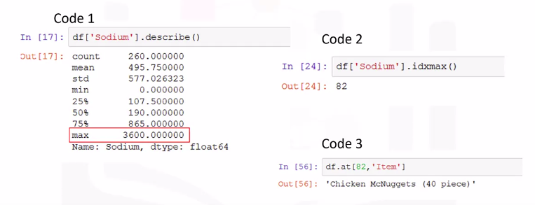</a>
				</p>
			* We use the __idxmax()__ method to compute the index values, at which the maximum value of sodium is obtained in the data frame
			* We will use the __at()__ method to find the item name by passing the index of 82 and the column name item, to be returned for the 82 row
	* Visualizations are very useful for initial data exploration. They can help us understand relationships, patterns, and outliers in the data
		* Scatter Plot
			* Let's first create a scatter plot with protein on the x-axis, and total fat on the y-axis
					<p align="center">
					  <a href="javascript:void(0)" rel="noopener">
						 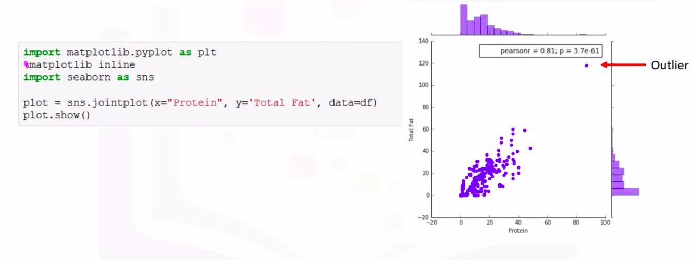</a>
					</p>
			* Scatter plots are very popular visualization tools and show the relationship between two variables with a point for each observation
			* To do this, we can use the joint plot function provided by the Seaborn package, and give as input, protein on the x-axis and total fat on the y-axis. And the data will be the data frame DF that contains the nutritional data set from McDonald's
			* Plot shows the correlation between the two variables: protein and fat
			* __Correlation__ is a measure of association between two variables, and has a value of between negative one and plus one
			* We see that the points on the scatter plot are closer to a straight line in the __positive direction__
				* So we have a __positive correlation__ between the two variables.
			* On the top right corner of the scatter plot, we have the values of the Pearson correlation 0.81 and the significance of the correlation denoted as P-which is a good value that shows the variables are certainly correlated
			* The plot also shows two histograms: one on the top and the other on the right side
				* The histogram on the top is that of the variable protein
				* The histogram on the right side is that of the variable total fat
			* __Note__ that there is a point on the scatter plot outside the general pattern
				* This is a possible outlier
		* Box Plot
			* Box plots are charts that indicate the distribution of one or more variables
			* The box in a box plot captures the middle 50 percent of data
			* Lines and points indicate possible skewness and outliers
					<p align="center">
					  <a href="javascript:void(0)" rel="noopener">
						 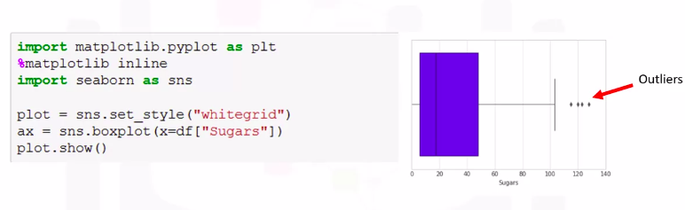</a>
					</p>
				* We have the box plot with average values of sugar and food items around 30 grams
				* Notice a few outliers that indicate food items with extreme values of sugar

## OPTIONAL: Using JOIN operations to work with multiple tables

### Join Overview

* A simple select statement retrieves data from one or more columns from a single table
* The next level of complexity is retrieving data from two or more tables
* This leads to multiple possibilities of how the ResultSet is generated
* To combine data from two tables, we use the JOIN operator
* A JOIN combines the rows from two or more tables based on a relationship between certain columns in these tables
* Example
	* Based on the book and author entity examples, these are part of a simplified library database mode
	* entity relationship diagram below represents the relational data model for the author and book entity as well as other entities such as borrower, loan, copy, and author list
					<p align="center">
					  <a href="javascript:void(0)" rel="noopener">
						 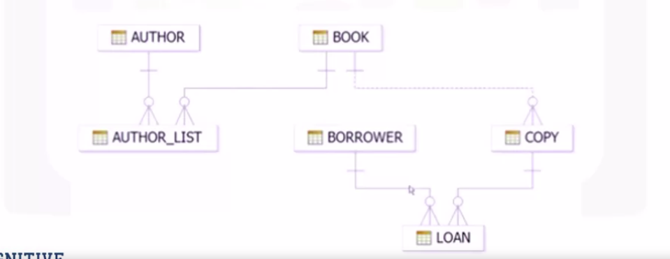</a>
					</p>
	* In this model, the information is split into different tables
	* If you wanted to know which borrower has which copy of a book out on loan, you need to gather data from three tables: the borrower, loan, and copy tables
		* This is when you need to use the JOIN operator
* With the JOIN operator, you are combining data from more than one table based on a relationship between certain columns in these tables
* So, the first thing you need to do is identify the relationship between those tables
	* That is, the column or columns in each table that will be used as a link between the tables
* NOTICE :  In this entity relationship diagram, notice the author_ID, book_ID, borrower_ID, and copy_ID had the primary key icon
* A primary key uniquely identifies each row in a table
* A foreign key is a set of columns referring to a primary key of another table
* Types of JOIN
	1. Inner Join
	1. Outer Join
		1. Left Outer Join
		1. Right Outer Join
		1. Full Outer Join


### Inner Join

> An inner join returns only data from the rows in the tables that match the inner join criteria.

* An inner join matches the results from two tables and displays only the result set that matches the criteria specified in the query
* An inner join returns only the rows that match.
					<p align="center">
					  <a href="javascript:void(0)" rel="noopener">
						 </a>
					</p>
* Syntax Inner Join
					<p align="center">
					  <a href="javascript:void(0)" rel="noopener">
						 </a>
					</p>
* Inner Join : OUTPUT DATA
					<p align="center">
					  <a href="javascript:void(0)" rel="noopener">
						 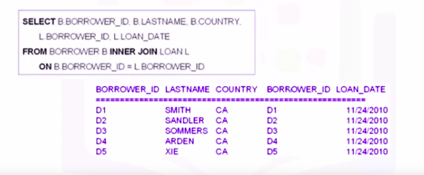</a>
					</p>
* Joining three tables
					<p align="center">
					  <a href="javascript:void(0)" rel="noopener">
						 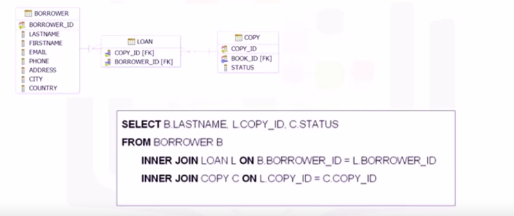</a>
					</p>
* Joining three tables : OUTPUT DATA
					<p align="center">
					  <a href="javascript:void(0)" rel="noopener">
						 </a>
					</p>

### Left Outer Join

* Outer Join is a specialized form of Join
* There are three types of Outer Join
	1. Left Outer Join
	1. Right Outer Join
	1. Full Outer Join
* __Left Outer Join__
	* All rows from Left table and matching rows from Right table
	* A left join matches the results from two tables and displays all the rows from the left table, and combines the information with rows from the right table that match the criteria specified in the query
	* In this diagram, a Left Join matches all the rows from table 1 and combines the information with rows from table 2 that match the criteria specified in the query
					<p align="center">
					  <a href="javascript:void(0)" rel="noopener">
						 </a>
					</p>
	* In an Outer Join, the first table specified in the FROM clause with the sequel statement is referred to as the left table, and the remaining table is referred to as the right table
	* Syntax Left Outer Join
					<p align="center">
					  <a href="javascript:void(0)" rel="noopener">
						 </a>
					</p>
	* Output of Left Outer Join
					<p align="center">
					  <a href="javascript:void(0)" rel="noopener">
						 </a>
					</p>
			* Notice there is a loan date for the first five rows: D1-D5. However, for the last three rows, the borrow ID and loan date show null values
				* A null value indicates an unknown value
			* When using a Left Join, if the right table does not have a corresponding value, a null value is returned
			* In this example, borrowers Peters, Li, and Wong, whose borrower IDs are D8, D6, and D7 have never taken a book out on loan
				* Therefore, there is no corresponding Borrower ID value in the loan table
					* Therefore, the result set displayed null values for these Borrower IDs

### Right Outer Join

* Outer Join is a specialized form of Join
* There are three types of Outer Join
	1. Left Outer Join
	1. Right Outer Join
	1. Full Outer Join
* __Right Outer Join__
	* All rows from Right table and matching rows from Left table
	* A right join matches the results from two tables and displays all the rows from the right table and combines the information with rows from the left table that matched the criteria specified in the query
	* In this diagram, the result set of a right join is all rows from both tables matching the criteria specified in the query plus all non-matching rows from the right table
					<p align="center">
					  <a href="javascript:void(0)" rel="noopener">
						 </a>
					</p>
	* In an outer join, the first table specified in the from clause of the SQL statement is referred to as the left table and the remaining table is referred to as the right table
	* Syntax Right Outer Join
					<p align="center">
					  <a href="javascript:void(0)" rel="noopener">
						 </a>
					</p>
	* Output of Right Outer Join
					<p align="center">
					  <a href="javascript:void(0)" rel="noopener">
						 </a>
					</p>
			* The Result Set shows each borrower ID from the loan table and the loan date for that borrower, where the borrower ID in the loan table also exists in the borrower table
			* There are five rows in the Result Set

### Full Outer Join

* Outer Join is a specialized form of Join
* There are three types of Outer Join
	1. Left Outer Join
	1. Right Outer Join
	1. Full Outer Join
* __Full Outer Join__
	* All rows from both tables
	* That is all rows from the left table and all rows from the right table
	* So, the full join could return a very large result set
					<p align="center">
					  <a href="javascript:void(0)" rel="noopener">
						 </a>
					</p>
	* The terms left and right refer to the table on the left-hand side and the right-hand side of the diagram
	* In this diagram table one is the left table
	* Syntax Full Outer Join
					<p align="center">
					  <a href="javascript:void(0)" rel="noopener">
						 </a>
					</p>
	* Output of Full Outer Join
					<p align="center">
					  <a href="javascript:void(0)" rel="noopener">
						 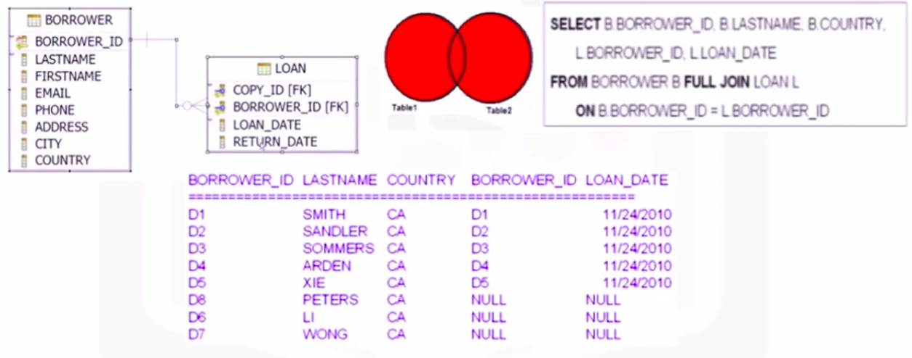</a>
					</p>
			* The result set shows all rows from the borrower table and all rows from the loan table
			* There are eight rows in the result set
			* All eight records from the borrower table are listed with the corresponding data from the loan table
			* However, in the last three rows the columns borrower ID and loan date from the loan table do not have a corresponding borrower ID
				* So a null value is returned
				* A null value is returned because borrowers Peters, Li, and Wong have never taken a book out on loan
				* Therefore, there is no corresponding borrower ID value in the loan table


