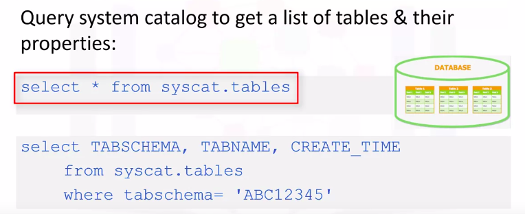
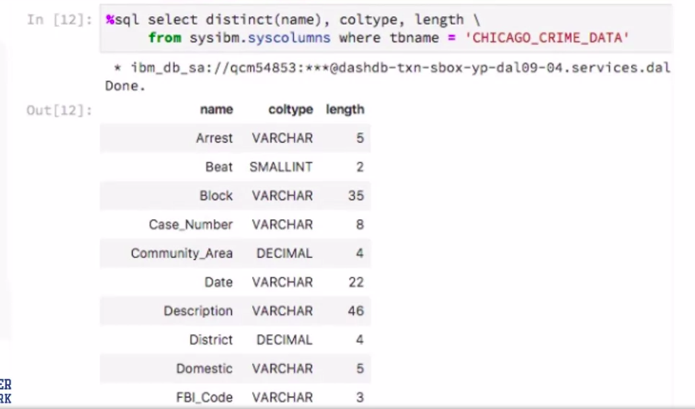

Databases and SQL for Data Science
===================================

by IBM

# Module 4

#
## Title: Introduction to Databases and Basic SQL

## Assignment Preparation: Working with real-world data sets and built-in SQL functions

### Working with Real World Datasets

* Many of the real world data sets are made available as.CSV files
	* These are text files which contain data values typically separated by commas
* In some cases a different separator such as a semicolon may be used
* We will use an example of a file called DOGS.CSV for this Section
	* Although this is a fictional data set that contains names of dogs and their breeds, we will use it to illustrate concepts that you will then apply to real datasets
	* Sample contents of the DOGS.CSV file are
					<p align="center">
					  <a href="javascript:void(0)" rel="noopener">
						 </a>
					</p>
		* The first row in the table in many cases contains attribute labels which map to column names in a table
		* In DOGS.CSV, the first row contains the name of three attributes
			* __ID__ is the name of the first attribute and the subsequent rows contain Id values of 1, 2, and 3
			* The __name of the dog__ is the second attribute
				* In this case the dog names Wolfie, Fluffy, and Huggy are the values
			* The third attribute is called __breed__, either the dominant breed or pure breed name
				* It has values of German Shepherd, Pomeranian, and Labrador
* CSV files can have the first or a header row that contains the names of the attributes
* Note that the default column names may not always be database or query friendly, and if that is the case, you may want to edit them before the table is created
* __Querying Column names with Mixed (upper and lower) Case__
	* Let's assume we loaded the DOGS.CSV file using the default column names from the CSV
	* If we try to retrieve the contents of the Id column using the query
		* we'll get an error as shown indicating the id is not valid
		* This is because the database parser assumes uppercase names by default
			```SQL
			>>> select id from DOGS
				OUTPUT: ERROR SHOWN IN IMAGE BELOW
			```
			<p align="center">
			  <a href="javascript:void(0)" rel="noopener">
				 </a>
			</p>
		* Whereas when we loaded the CSV file into the database it had the Id column name in mixed case i.e an uppercase "I" and a lowercase "d"
		* In this case, to select data from a column with a mixed case name, we need to specify the column name in its correct case within double quotes
			```SQL
			>>> select "Id" from DOGS
			```
		* Ensure you use double quotes around the column name and not single quotes
* __Querying Column names that have Spaces or Special Character__
	* In a CSV file if the name of the column contain spaces, by default the database may map them to underscores
	* For example, in the __Name of Dog__ column, there are spaces in between the three words. The database may change it to __Name_of_Dog__
			<p align="center">
			  <a href="javascript:void(0)" rel="noopener">
				 </a>
			</p>
	* Other special characters like parentheses or brackets may also get mapped to underscores
	* Therefore, when you write a query ensure you use proper case formatting within quotes and substitute special characters to underscores
			<p align="center">
			  <a href="javascript:void(0)" rel="noopener">
				 </a>
			</p>
	* Note the underscores separating the words within double quotes
	* It's also important to note the trailing underscore after the word breed near the end of the query
		* This is used in place of the closing bracket
* __Using Quotes in Jupyter Notebook__
	* When using quotes in Jupyter notebooks, you may be issuing queries in a notebook by first assigning them to Python variables
		* In such cases if your query contains double quotes for example, to specify a mixed case column name, you could differentiate the quotes by using single quotes for the Python variable to enclose this SQL query and double quotes for the column names
		* For Example
			```Python
			>>> selectQuery = 'select "Id" from DOGS'
			```
	* If you need to specify single quotes within the query
		* For example, to specify a value in the where clause
			* In this case you can use backslash as the escape character
				```Python
				>>> selectQuery = 'select * from DOGS where "Name_of_Dog" = \'Huggy\''
				```
* __Splitting Queries to Multiple Lines in Jupyter__
	* If you have very long queries such as join queries or nested queries, it may be useful to split the query into multiple lines for improved readability
	* In Python notebooks, you can use the backslash character to indicate continuation to the next row
			<p align="center">
			  <a href="javascript:void(0)" rel="noopener">
				 </a>
			</p>
	* Please keep in mind that you might get an error if you split the query into multiple lines in a Python notebook without the backslash
	* When using SQL magic, you can use the double percent SQL in the first line of the cell in Jupyter Notebooks
		* It implies that the rest of the content of the cell is to be interpreted by SQL magic
			<p align="center">
			  <a href="javascript:void(0)" rel="noopener">
				 </a>
			</p>
	* When using %% sql the backslash is not needed at the end of each line
* __Restrict Number of Rows Retrieved__
	* You can restrict the results set by using the limit clause
		```SQL
		>>> select * from census_data LIMIT 3
		```
	* Same can be done after loading data in Pandas Dataframe and then using head() method to restrict rows, but this approach would take lots of resources and time to load data into memory and then applying operations on it

### Getting Table and Column Details

* __Getting a List of Tables in a Database__
	* Sometimes your database may contain several tables, and you may not remember the correct name
		* For example, you may wonder whether the table is called dog, dogs or four legged mammals
	* Database systems typically contain system or catalog tables, from where you can query the list of tables and get their properties
		* In __DB2__ this catalog is called __syscat tables__
		* In __SQL Server__, it's __information schema tables__
		* In __Oracle__ it's __all tables__ or __user tables__
	* To get a list of tables in a DB2 database, you can run the following query
		* This select statement will return too many tables including system tables, so it's better to filter the result
			```SQL
			>>> select * from syscat.tables
			```
			<p align="center">
			  <a href="javascript:void(0)" rel="noopener">
				 </a>
			</p>
		* Query to filter the results of syscat.tables
			```SQL
			>>> select TABLESCHEMA, TABNAME, CREATE_TIME from syscat.tables where TABLESCHEMA = 'ABC12345'
			```
		* Please ensure that you replace ABC12345 with your own DB2 username
* __Getting Table Properties__
	* If you want to check which of the was created last
			```SQL
			>>> select TABLESCHEMA, TABNAME, CREATE_TIME from syscat.tables where TABLESCHEMA = 'QCM54853'
			```
			<p align="center">
			  <a href="javascript:void(0)" rel="noopener">
				 </a>
			</p>
		* The output will contain the schema name, table name, and creation time for all tables in your schema
* __Getting a List of Columns in the Database__
	* If you can't recall the exact name of a column for example, whether it had any lowercase characters or an underscore in its name, in DB2 you can issue a query
		```SQL
		>>> select * from syscat.columns where tabname = 'DOGS'
		```
	* For your information in MySQL, you can simply run the command 
		```SQL
		>>> SHOW COLUMNS FROM DOGS
		```
	* If want to know specific properties like the datatype and length of the datatype
		* In DB2, you can issue a statement like
			```SQL
			>>> select distinct(name), coltype, length
			>>> 	from sysibm.syscolumns
			>>>			where tbname = 'DOGS'
			```
	* Here, look at the results of retrieving column properties, for a real table called Chicago Crime Data from a Jupyter notebook
			<p align="center">
			  <a href="javascript:void(0)" rel="noopener">
				 </a>
			</p>
		* Notice in the output, you can tell certain column names show different cases
		* For example, the column titled arrest has an uppercase A, and the rest of the characters are lowercase
		* So, keep in mind that when you refer to this column in your query, not only must you enclose the word arrest within double quotes, you must also preserve the correct case inside the quotes

